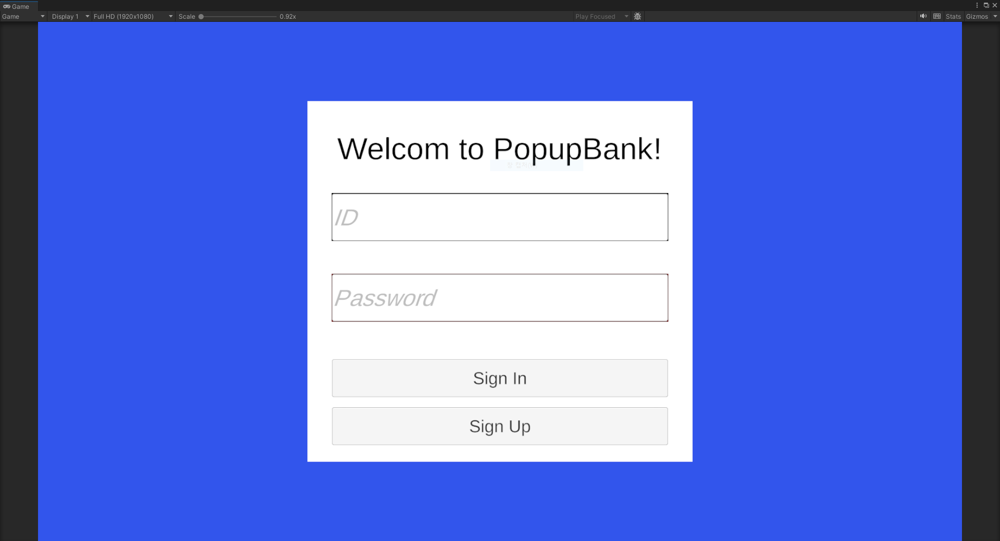
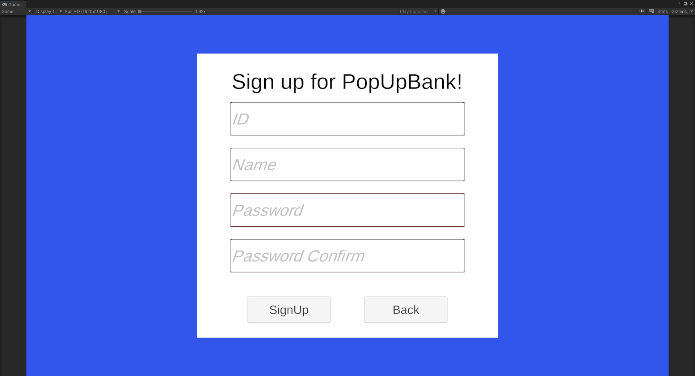
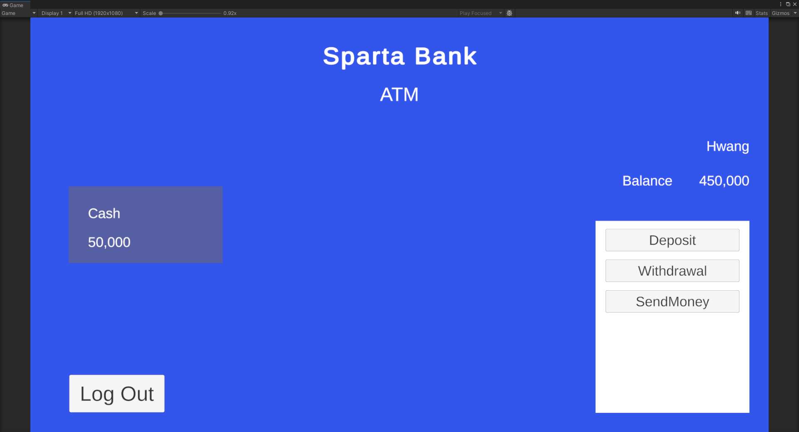
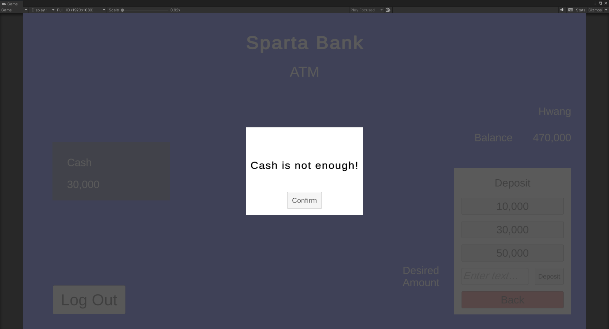
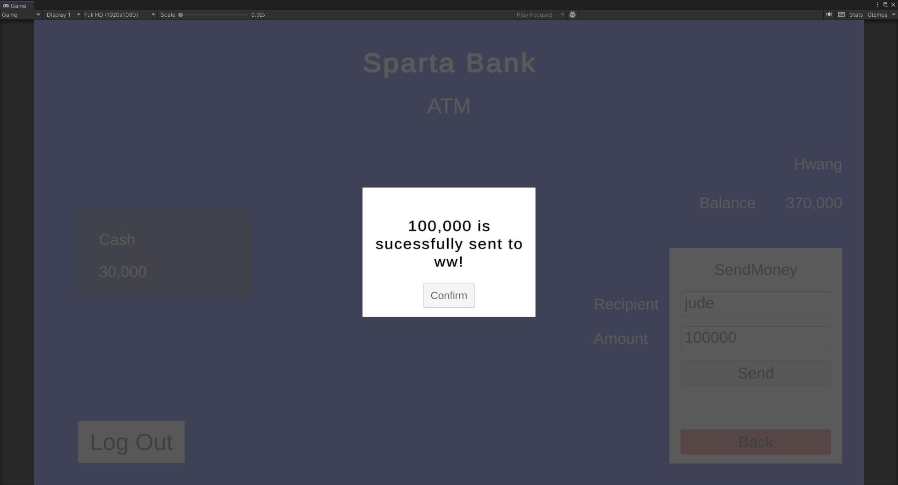

#  Unity ATM 시뮬레이터 프로젝트

**Unity를 활용한 ATM(현금 입출금기) 시뮬레이터**입니다. UI 구성부터 사용자 데이터 처리, 입출금 기능 및 JSON을 통한 데이터 저장/불러오기까지 구현되어 있으며, UI 구현과 데이터 처리를 연습했습니다.

---

## 썸네일

---

##  목표

- 유니티 UI 구성 및 이벤트 시스템 학습
- 싱글톤 패턴을 활용한 게임 매니저 관리
- 사용자 데이터 클래스를 통한 정보 저장
- 입출금 로직 구현
- JSON 기반 저장/불러오기 기능 구현

---

##  프로젝트 정보

| 항목 | 내용 |
|------|------|
| 개발 환경 | Unity 2022.3.17f |
| 언어 | C# |
| 저장 방식 | JsonUtility를 활용한 로컬 파일 저장 |

---

##  주요 기능

###  기본 UI 구성
- 사용자 이름 및 통장 잔액 출력 (잔액: 천 단위 콤마 포함)
- 로그인 및 회원가입 기능
- 현금 보유량 표시
- 입금 / 출금 / 송금 버튼
- 에러 팝업 표시

###  데이터 처리
- `UserData` 클래스
    - 이름, 현금, 잔액, 비밀번호
- 'UserInfo' 클래스
    - UserData 객체와 ID
- 'UserDataBase' 클래스
    - UserInfo 리스트 저장
    - 로드 시 Key ID Value UserData의 딕셔너리로 캐스팅
- `GameManager` 클래스 (싱글톤)
    - 게임 내 유저 데이터 초기화 및 관리
    - `Refresh()` 메서드로 UI 갱신

### 저장/불러오기 기능
- JsonUtility를 이용한 사용자 데이터 저장
- 게임 시작 시 저장된 데이터 자동 로드
- 입출금 시 데이터 자동 저장

---

